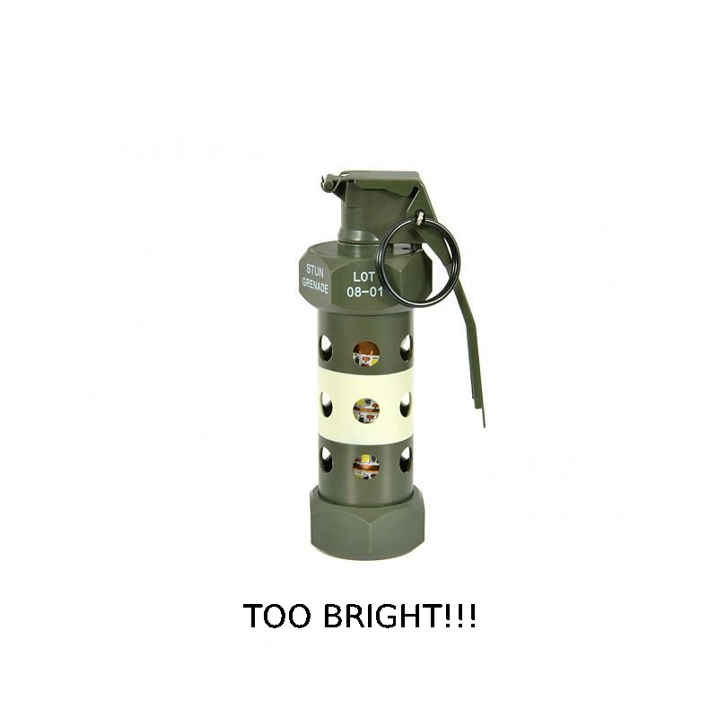
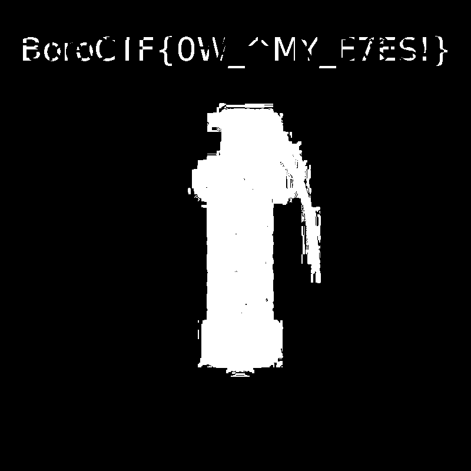

# Retinal Burn — Writeup

**CTF:** BoroCTF
**Challenge:** Retinal Burn
**Category:** Steganography / Forensics
**Points:** 200
**Solves:** 189

---

## Description

> My friend Jonas Wagner sent me a challenge but I can't be bothered to do it. He was always one to be working on his own sorts of projects and stuff. You do it.

The challenge provided a single image:

```text
burn.png
```

At first glance, the image showed a flash grenade on a bright white background alongside the text:

```text
TOO BRIGHT!!!
```

This immediately suggested that the challenge might involve manipulating image brightness, contrast, or color channels.

---

## Initial Analysis

The first step was to perform standard forensic and steganographic checks.

```bash
file burn.png
exiftool burn.png
strings -a burn.png
binwalk burn.png
zsteg -a burn.png
```

Results:

* No embedded files were detected.
* No useful metadata was present.
* No interesting strings appeared.
* No LSB payloads were identified.

Since the usual techniques did not reveal anything useful, a different approach was required.

---

## Original Image



---

## Investigating the Color Channels

The challenge title **Retinal Burn** and the phrase **TOO BRIGHT!!!** strongly hinted that the hidden data might be concealed using subtle color differences.

The RGB channels were extracted individually:

```bash
convert burn.png -channel R -separate red.png
convert burn.png -channel G -separate green.png
convert burn.png -channel B -separate blue.png
```

However, inspecting each channel separately did not reveal any visible message.

---

## Channel Difference Analysis

Since the individual channels appeared normal, the next step was to compare them directly.

Using ImageMagick:

```bash
convert burn.png -fx "abs(g-b)*255" diff.png
```

The resulting image was then normalized to amplify the hidden differences:

```bash
convert diff.png -normalize diff.png
```

Opening the processed image immediately exposed previously invisible content.

---

## Recovered Message

The channel-difference image revealed hidden text above the flash grenade.



The recovered flag was:

```text
BoroCTF{0W_^MY_E7ES!}
```

The characters were intentionally distorted:

* `0` instead of `O`
* `7` instead of `Y`
* Additional punctuation inserted into the text

Despite the visual distortion, the flag could be transcribed correctly and was accepted by the challenge server.

---

## Flag

```text
BoroCTF{0W_^MY_E7ES!}
```

---

## Lessons Learned

* Not all steganography challenges rely on LSB encoding.
* RGB channel differences can effectively conceal information from visual inspection.
* When dealing with bright or high-contrast images, always investigate:

  * Individual color channels
  * Channel subtraction
  * Channel XOR operations
  * Contrast normalization techniques
* Challenge titles often contain valuable hints about the intended solution path.

---

## Tools Used

* ImageMagick
* file
* exiftool
* strings
* binwalk
* zsteg

---

## Takeaway

This challenge demonstrates how subtle differences between color channels can hide data in plain sight. While standard steganography tools produced no useful results, comparing and normalizing RGB channel differences immediately revealed the hidden flag.

Sometimes the best clue is the challenge theme itself: in this case, a flash grenade and the phrase **"TOO BRIGHT!!!"** pointed directly toward image-channel manipulation.

