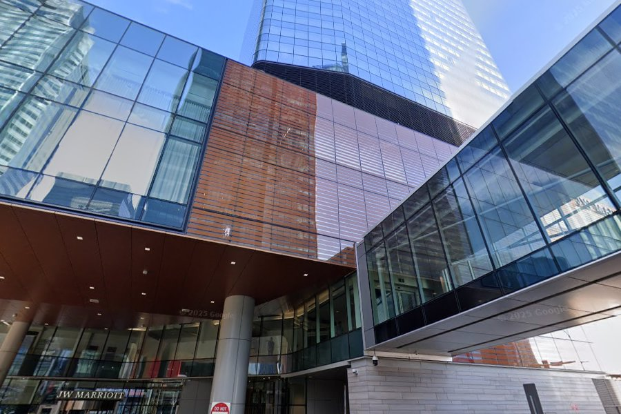

# boroCTF 2025 - Geopro 3 Writeup

## Challenge Information

| Category  | OSINT / GeoINT |
| --------- | -------------- |
| Challenge | Geopro 3       |
| Points    | 200            |
| Solves    | 212            |

### Description

> What is the really tall building I'm looking at...
>
> Flag format:
>
> `boroCTF{building_name}`
>
> Replace any spaces with underscores.

---

## Initial Analysis

The challenge provided a single street-level image showing the base of a modern skyscraper.

Key observations:

* A visible **JW Marriott** sign near the entrance.
* A large glass skyscraper rising above the podium.
* Distinctive copper/terracotta-colored cladding.
* Glass skybridge connecting sections of the complex.
* Modern downtown business district architecture.



---

## Step 1 – Identify the Hotel

The most obvious clue was the visible:

```text
JW Marriott
```

Rather than searching for every JW Marriott location worldwide, the goal was to identify a property matching the architectural features shown in the image.

Important architectural characteristics:

* Curved glass tower
* Copper-colored exterior panels
* Glass skybridge
* Large mixed-use development

---

## Step 2 – Reverse Architectural Search

Searching for:

```text
JW Marriott skyscraper skybridge
JW Marriott glass tower copper panels
JW Marriott modern downtown tower
```

quickly narrowed the possibilities.

One property stood out:

**JW Marriott Edmonton ICE District**

The photographs of the building matched the challenge image almost perfectly.

---

## Step 3 – Verify the Location

Comparing the challenge image against publicly available photos revealed multiple matching elements:

### Matching Features

* JW Marriott branding at ground level
* Distinctive copper-toned facade sections
* Glass skybridge
* Curved reflective tower
* Entrance layout and structural columns

The building is located within Edmonton's ICE District development.

---

## Step 4 – Determine the Expected Flag

The challenge asked for the building name with spaces replaced by underscores.

Building name:

```text
JW Marriott Edmonton ICE District
```

Converted to flag format:

```text
boroCTF{JW_Marriott_Edmonton_ICE_District}
```

---

## Flag

```text
boroCTF{JW_Marriott_Edmonton_ICE_District}
```

---

## Takeaways

This challenge demonstrates a common GeoINT workflow:

1. Extract visible textual clues.
2. Identify unique architectural features.
3. Search for matching real-world locations.
4. Verify using multiple visual indicators.
5. Convert the identified location into the required flag format.

Even when only a small amount of text is visible, combining branding with distinctive architecture can quickly lead to the correct answer.

**Difficulty:** Easy

**Skills Used:**

* GeoINT
* OSINT
* Visual building identification
* Architectural comparison
* Open-source image research

